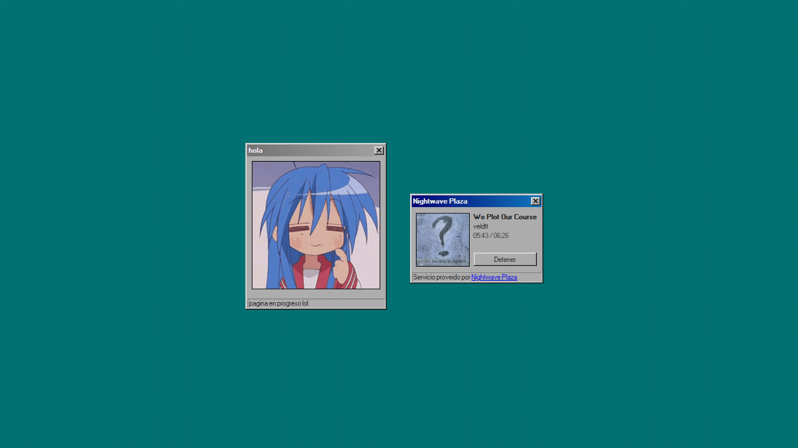

# whisp.jorge603.xyz

Pagina personal destinada a recrear la experiencia de escritorio de windows 95/98

[](https://whisp.jorge603.xyz)

Actualmente dispone de una ventana de ejemplo y servicio de streaming proveido por [Nightwave Plaza](https://plaza.one)

## Correr de forma local

Si lo deseas, puedes correr el proyecto de forma local, ya sea para hacer tu propia pagina a base de esta o investigar el codigo fuente

Debido a que esta pagina esta diseñada para ser hosteada con github sites, no necesitas instalar dependencias, por lo que lo unico que necesitas hacer es clonar el proyecto

```bash
git clone --single-branch --branch pagina https://github.com/ItsWhisp/ItsWhisp
```

Se recomienda especificar la rama (branch) al clonar, para evitar clonar otras ramas, si buscas clonar la pagina probablemente la que necesites sea esta, asi que probablemente quieras usar el comando de arriba

Si usas **Visual Studio Code**, puedes correr un servidor rapido de forma local usando la extension [Live Server](https://marketplace.visualstudio.com/items?itemName=ritwickdey.LiveServer) o [Five Server](https://marketplace.visualstudio.com/items?itemName=yandeu.five-server)