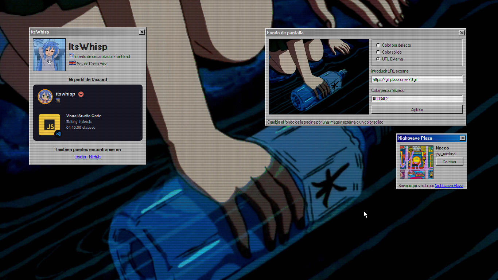

# whisp.jorge603.xyz

Pagina personal con la estetica de Windows 95/98, que usa HTML, CSS y JavaScript puro

[](https://whisp.jorge603.xyz)

<p align="center">Pagina disponible en <a href="https://whisp.jorge603.xyz" target="_blank">whisp.jorge603.xyz ⧉</a></p>

## Correr de forma local

Si lo deseas, puedes correr el proyecto de forma local y modificar el codigo fuente a libertad

Debido a que esta pagina esta hosteada en github sites no cuenta con dependencias, por lo que lo unico que necesitas es clonar esta rama (branch)

```bash
git clone --single-branch --branch pagina https://github.com/ItsWhisp/ItsWhisp
```

Puedes usar la extension [Live Server](https://marketplace.visualstudio.com/items?itemName=ritwickdey.LiveServer) o [Five Server](https://marketplace.visualstudio.com/items?itemName=yandeu.five-server) desde Visual Studio Code para hostear un servidor local de sitios web estaticos de forma conveniente

## Contribuir

Eres libre de hacer issues y pull requests si asi los deseas, estos pueden ser aceptados si aportan algo de interes a la pagina y no modifican el contenido de esta misma